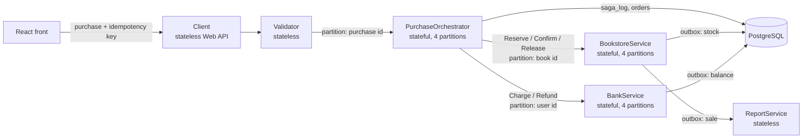
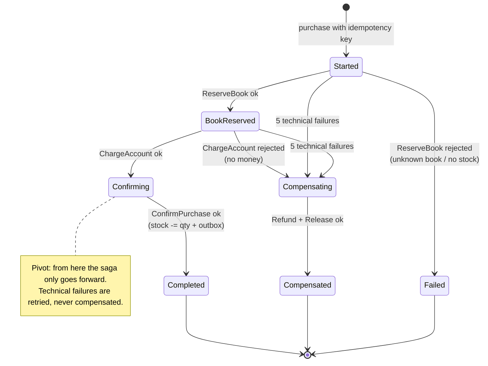

# Cloud-Computing-Task

## System design

```mermaid
flowchart LR
    FE[React front] -->|purchase + idempotency key| C[Client<br/>stateless Web API]
    C --> V[Validator<br/>stateless]
    V -->|partition: purchase id| O[PurchaseOrchestrator<br/>stateful, 4 partitions]
    O -->|Reserve / Confirm / Release<br/>partition: book id| B[BookstoreService<br/>stateful, 4 partitions]
    O -->|Charge / Refund<br/>partition: user id| K[BankService<br/>stateful, 4 partitions]
    O -->|saga_log, orders| DB[(PostgreSQL)]
    B -->|outbox: stock| DB
    B -->|outbox: sale| R[ReportService<br/>stateless]
    K -->|outbox: balance| DB
```

## Saga pattern

```mermaid
stateDiagram-v2
    [*] --> Started : purchase with idempotency key
    Started --> BookReserved : ReserveBook ok
    Started --> Failed : ReserveBook rejected<br/>(unknown book / no stock)
    BookReserved --> Confirming : ChargeAccount ok
    BookReserved --> Compensating : ChargeAccount rejected<br/>(no money)
    Started --> Compensating : 5 technical failures
    BookReserved --> Compensating : 5 technical failures
    Confirming --> Completed : ConfirmPurchase ok<br/>(stock -= qty + outbox)
    Compensating --> Compensated : Refund + Release ok
    Completed --> [*]
    Compensated --> [*]
    Failed --> [*]

    note right of Confirming
        Pivot: from here the saga only goes forward.
        Technical failures are retried, never compensated.
    end note
```
